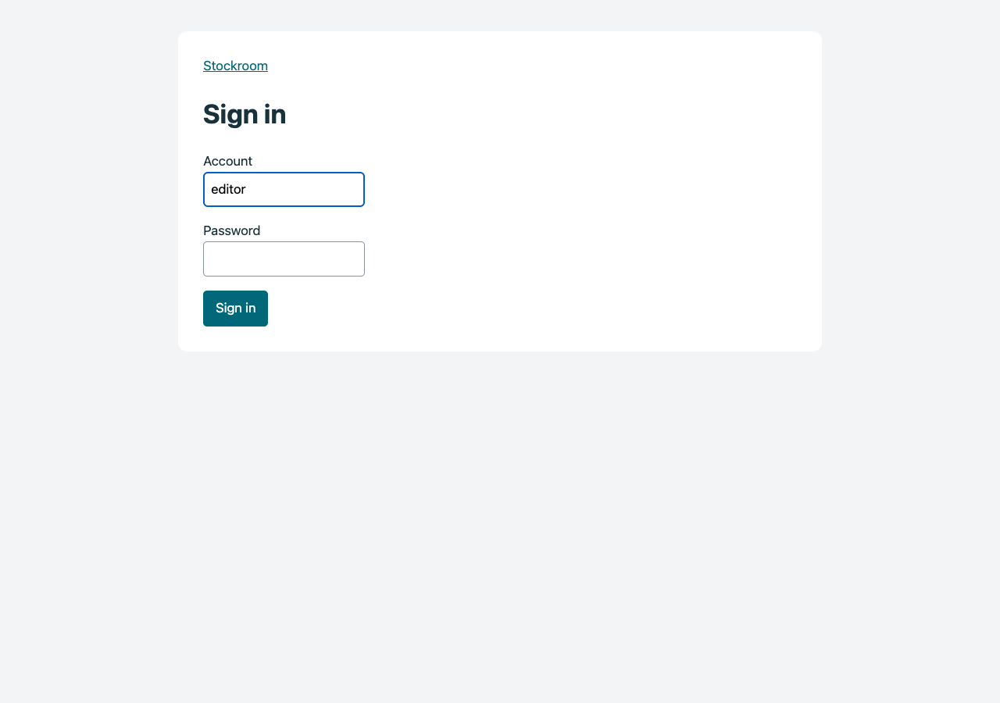
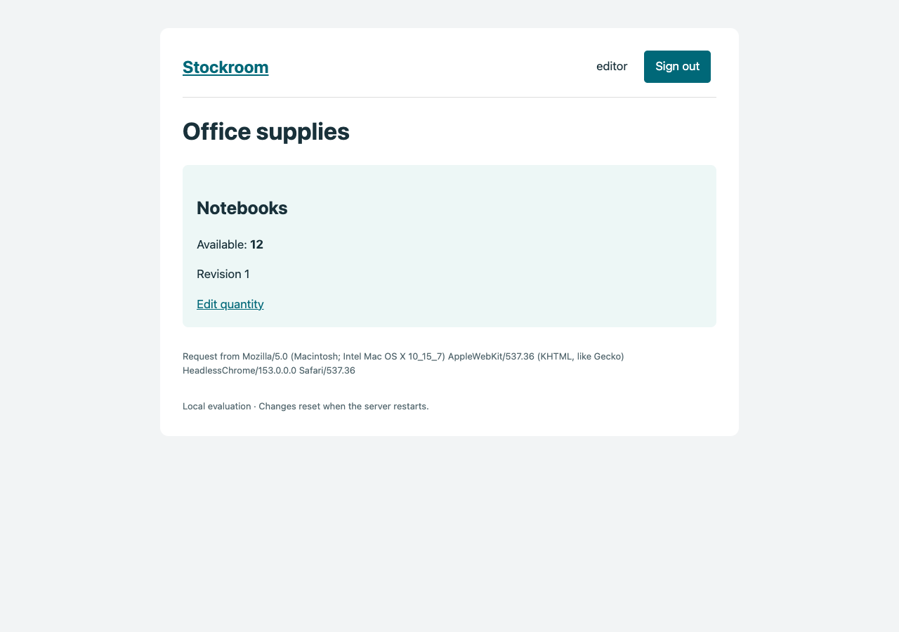
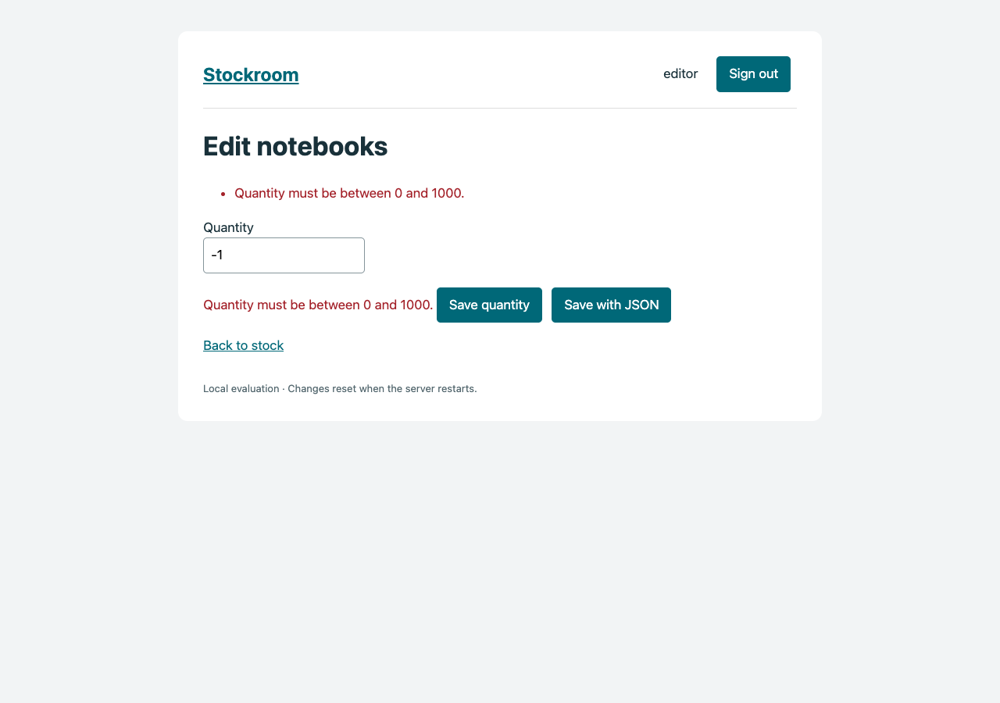
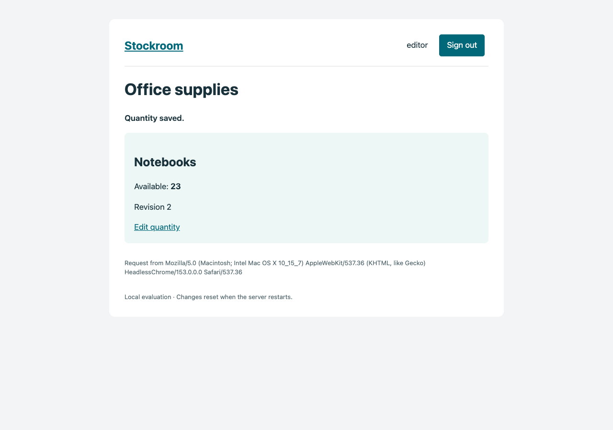

# Stockroom running locally

These inspected captures show **accepted U59**, using a disposable Editor account in an isolated Playwright1.63.0/Chromium153 browser on .NET10.0.2. No production data or real account credentials appear. U60 retains this local flow and adds deployment configuration; the screenshots do not demonstrate later unobtrusive client-side validation.

[Run the current U60 demo](../Stockroom/README.md) · [10-second walkthrough](Stockroom-U59-walkthrough.webm)

| Login | Authenticated stock |
|---|---|
|  |  |

| Server validation | Saved result |
|---|---|
|  |  |

The invalid form reaches original MVC server validation. The valid protected form awaits the staged update, redirects and displays a one-time TempData confirmation.
